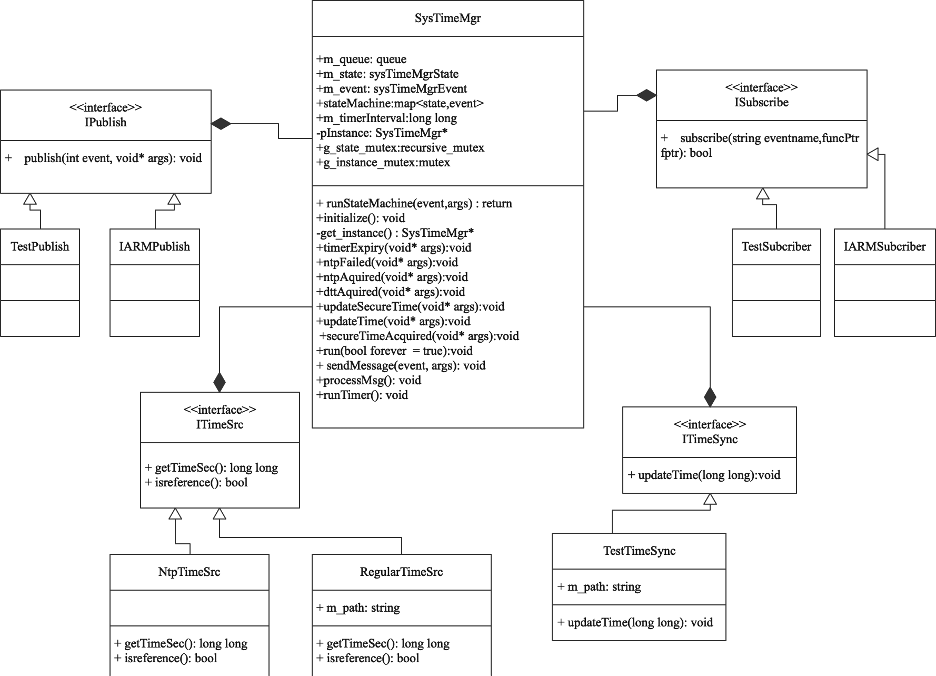
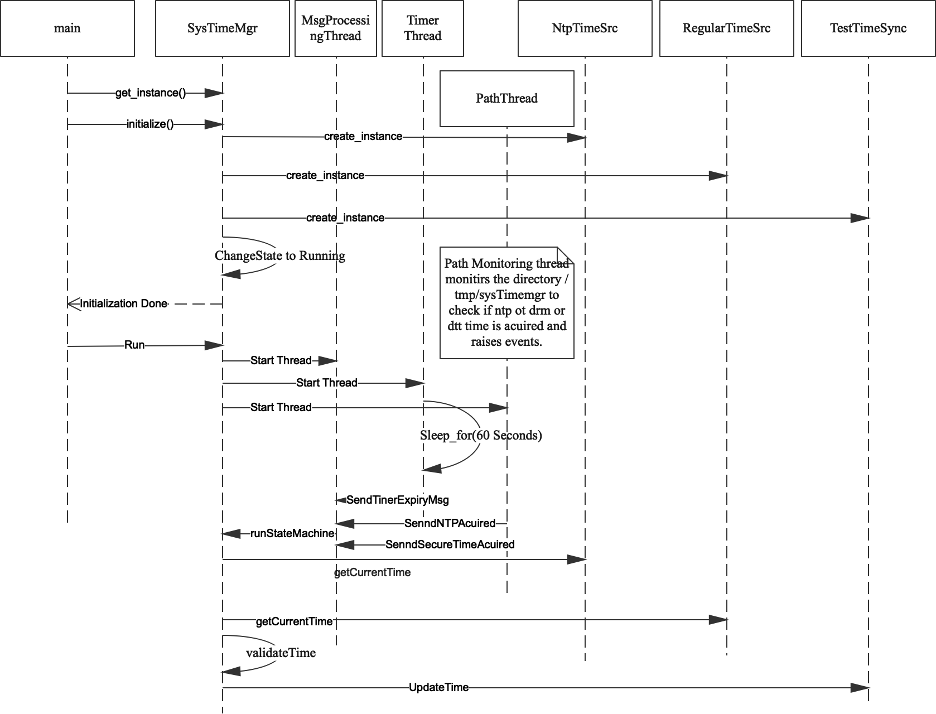
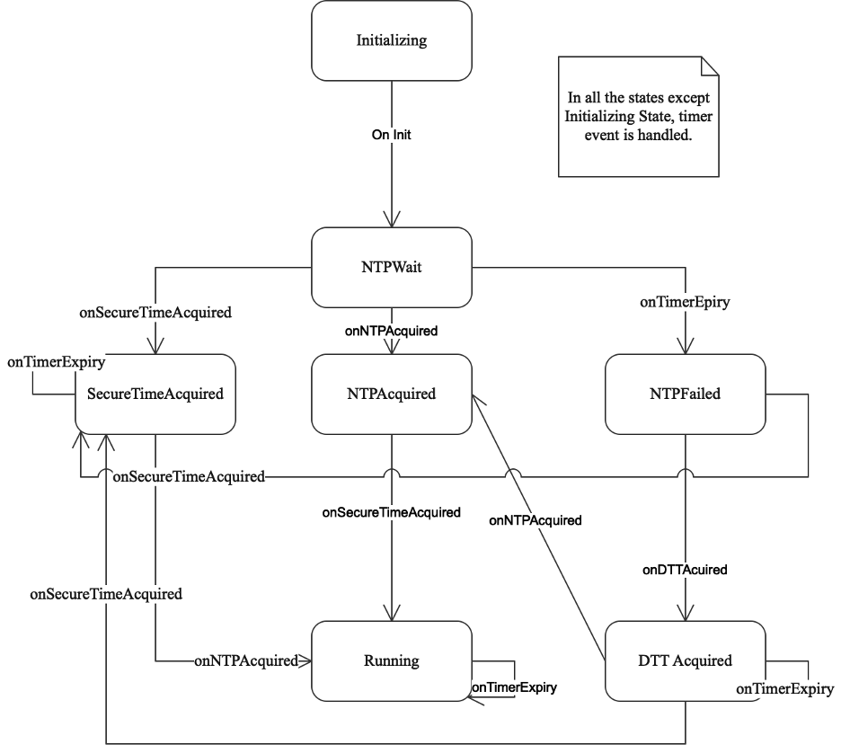

# System Time Mgr High Level Design.

# 1. Introduction

The purpose of this document is to provide a way for securing the time on the system. System time is used for a variety of purposes on Set Top Boxes, such as setting DVR times, showing accurate program guides. In addition to that time is used in validating certificates also. If we let people tamper with time, we expose our boxes to use expired certificates which is a bigger problem.

As of now we don&#39;t have a systemwide time management system available in any of RDK devices. The document tries to explore with a high-level design so we could use it in all of our devices.

There are several time sources NTP, VG DRM, STT(RDKV Specific). We need a Time Manager which can take in all the time sources validate and save in a secure location. This is needed so when we boot up, we could start with the known time.

Subsequent sections will try to achieve above mentioned objectives.

# 2. Class Diagram

## 2.1 SysTimeMgr

This is the singleton instance which is responsible for managing Time Sources and Time Sync.

Time Source is providers of time. Time Sync is where time is updated for reboot recovery. This checks for time drift for the configured time intervals.

## 2.2 ITimeSrc

This is an interface class for operating with time sources and provide an interface method to query for time from the sources.

### 2.2.1 NtpTimeSrc

This class implements ITimeSrc interface. It uses ntp api (ntp\_gettime) to extract the time. we can find out time as well as the drift info which is populated by the ntp daemons.

### 2.2.2 RegularTimeSrc

This class implements ITimeSrc interface. This is a class which reads time from the configured file.

## 2.3 ITimeSync

This is an interface provided for saving or updating time in secure location.

### 2.3.1 TestTimeSync.

This implements ITimeSync interface. This is will update the timestamp on the file stats by touching a path.

## 2.4 IPublish

This is an interface indicating how systimemgr publishes time events.

It is assumed there is a messaging mechanism implemented in the system, leaf class would make use of it.

### 2.4.1 TestPublish

This is test implementation which prints to console the publishing data.

### 2.4.2 IARMPublish

This is IARM based implementation of publishing the events.

## 2.5 ISubscriber

This interface provides a way for exposing a function to be run in the context of bus.

### 2.5.1 TestSubscriber

This is a test implementation, where it prints the registration function.

### 2.5.2 IARMSubscriber

As name indicates this is IARM Based implementation.

###

# 3. Sequence Diagram

# 4. State Diagram

The following are the states and its definition.

- **Initializing:** This is the default state that we initialize with. In this state we initialize parameters needed .
- **NTPWait:** This indicates we are waiting to acquire time from ntp. If 10 min timer expires we will be updating TEE time with 0, which indicates to auto increment. As well as change state to NTPFail.
- **NTPFail:** This indicates we failed to acquire NTP Time in 10 minutes. Further 10min timer expiries will trigger update of TEE time with 0.
- **NTPAcquired:** Indicates we have acquired NTP Time, and waiting for Secure Time acquisition. As usual on 10 min timer expiry we update TEE time with 0.
- **SecureTimeAcquired:** In this state, we have acquired securetime and waiting for NTP Time to be acquired.
- **DTTAcquired:** This state indicates acquisition of DTT Time and waiting for NTP and Secure Time.
- **Running:** This state indicates that NTP and Secure Time is acquired. On every 10 min timer expiry we check the drift of securetime and ntp time. If the drift is greater that 10 minutes, we update TEE Time to 0 otherwise we update with NTP Time.

# 5. Appendix

Tried out using Lambda functions for ISubscriber, but considering aspect that bus registration could be using C dropped the idea. If interested pls read at [https://www.cprogramming.com/c++11/c++11-lambda-closures.html](https://www.cprogramming.com/c++11/c++11-lambda-closures.html)
