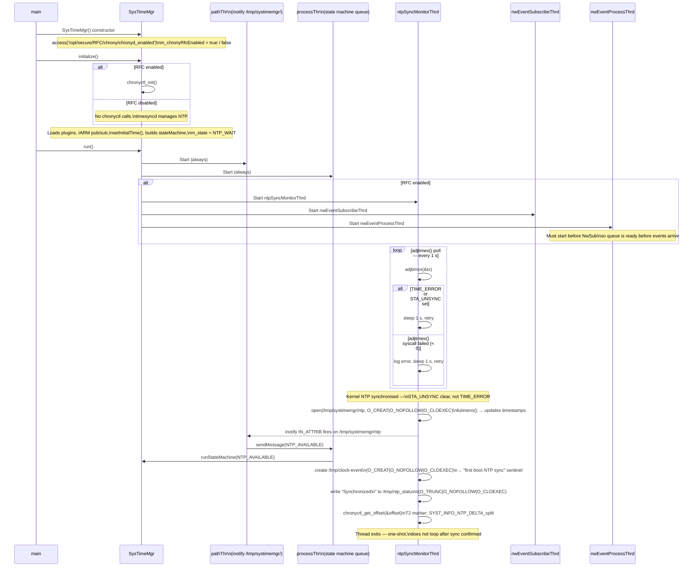

# Diagram: Chrony RFC Mode — Thread Startup and NTP Sync Monitor

Shows the RFC gate decision at construction time, which threads are started when Chrony mode is active, and the one-shot behavior of `ntpSyncMonitorThrd` once the kernel clock becomes NTP-synchronized.

**Related spec:** [specs/chrony-ntp-sync/spec.md](../specs/chrony-ntp-sync/spec.md)

---

