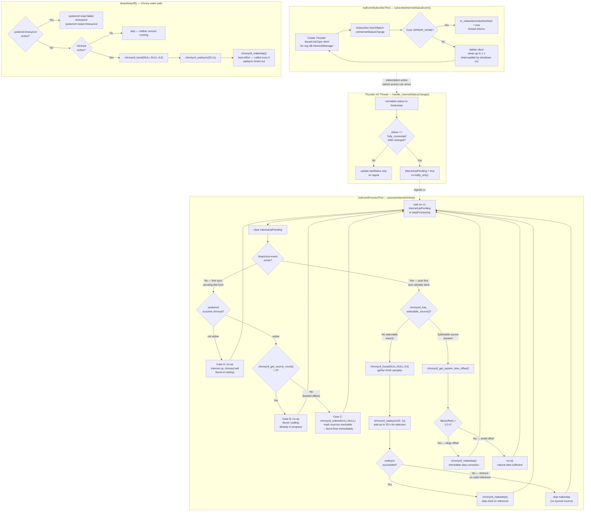

# Diagram: Network Event-Driven Chrony Sync

Shows the Thunder subscription retry loop (`nwEventSubscribeThrd`), how `fully_connected` events are filtered and handed off to `nwEventProcessThrd` via a condition variable, the 6 decision paths in `processInternetOnline()`, and the deep sleep wake path in `deepsleepoff()`.

**Related spec:** [specs/chrony-ntp-sync/spec.md](../specs/chrony-ntp-sync/spec.md)

---

> **Key difference — makestep guard**: In `processInternetOnline()` (Scenario D) `makestep` is **skipped** when `waitsync` times out (no valid reference). In `deepsleepoff()` `makestep` is **always attempted** after `waitsync` (best-effort on wake).
