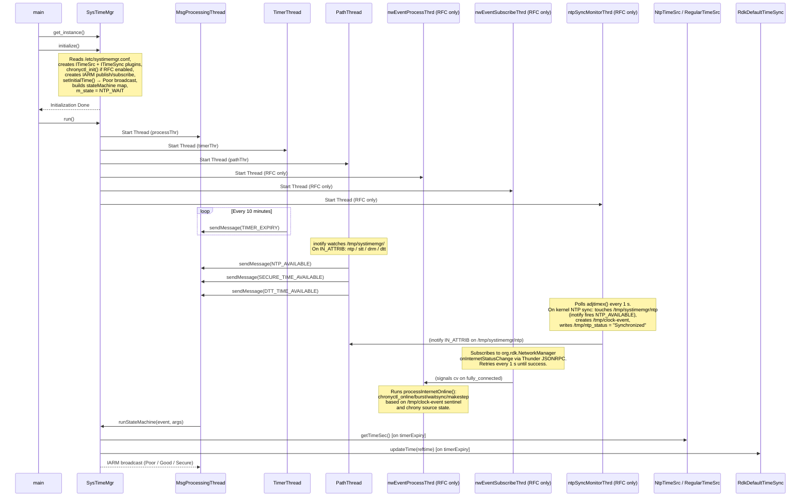

# Diagram: SystemTimeManager Architecture — Thread Model and Message Flow

Shows the full thread model, initialization sequence, and how events flow between threads into the state machine. Threads in parentheses are only started when `m_chronyRfcEnabled` is `true` (RFC feature flag present at `/opt/secure/RFC/chrony/chronyd_enabled`).

**Related spec:** [specs/time-quality/spec.md](../specs/time-quality/spec.md)

---

