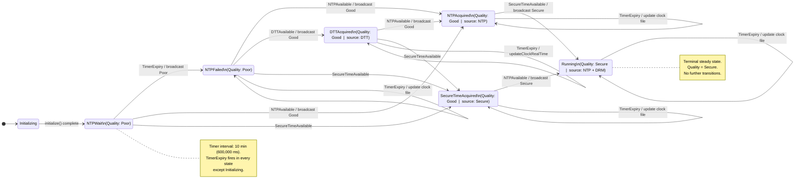

# Diagram: NTP Time Quality State Machine

Shows all states, the events that trigger transitions, and the IARM broadcast emitted at each transition. Each state label includes the resulting time quality level. Self-loops (TimerExpiry) in steady states update the clock file but do not change quality.

**Related spec:** [specs/time-quality/spec.md](../specs/time-quality/spec.md)

---

---

## Quality Levels Summary

| State | Quality | IARM broadcast |
|---|---|---|
| Initializing | Poor | Poor (from `setInitialTime()`) |
| NTPWait | Poor | — (waiting) |
| NTPFailed | Poor | Poor (on `TimerExpiry` from NTPWait) |
| NTPAcquired | Good | Good |
| DTTAcquired | Good | Good |
| SecureTimeAcquired | Good | — (quality set to Good; Secure broadcast deferred) |
| Running | Secure | Secure |

## Event Glossary

| Event | Trigger source |
|---|---|
| `NTPAvailable` | `pathThr` inotify on `/tmp/systimemgr/ntp` (touched by `ntpSyncMonitorThrd` or NtpTimeSrc plugin) |
| `DTTAvailable` | `pathThr` inotify on `/tmp/systimemgr/dtt` |
| `SecureTimeAvailable` | `pathThr` inotify on `/tmp/systimemgr/drm` |
| `TimerExpiry` | `timerThr` — fires every 10 minutes |

> **Wiki vs. code discrepancy**: The Confluence state diagram shows a `Running → SecureTimeAcquired` back-transition. That transition does **not** exist in the code's `stateMachine` map and is a documentation artifact. The diagram above reflects the actual implementation.
