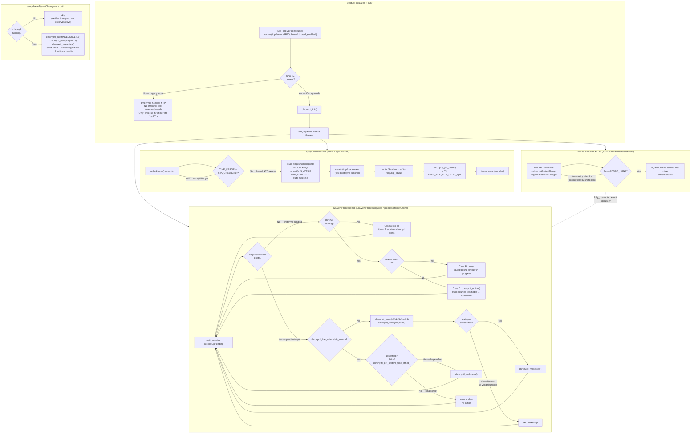

## Purpose

Defines how SystemTimeManager integrates Chrony-based NTP synchronization when the RFC feature flag is enabled. Covers the RFC gate condition, the additional threads launched at startup, the NTP sync monitor (adjtimex polling), Thunder network-event-driven chrony control, deep sleep wake behavior, and the full `chronyctl` library integration contract.

When the RFC flag is absent, NTP synchronization is handled entirely by `systemd-timesyncd` with no additional threads, no `chronyctl` calls, and no Thunder network event subscription.

---

## Flow Diagram



---

## Requirement: RFC Gate Controls Chrony Mode

SystemTimeManager MUST enable Chrony-specific behavior only when the RFC feature flag file is present at construction time.

### Scenario: RFC file present — Chrony mode enabled

- **WHEN** `SysTimeMgr` is constructed
- **AND** `/opt/secure/RFC/chrony/chronyd_enabled` exists (`access()` returns 0)
- **THEN** `m_chronyRfcEnabled` is `true`
- **AND** `chronyctl_init()` is called during `initialize()`
- **AND** `run()` launches three additional threads: `nwEventProcessThrd`, `nwEventSubscribeThrd`, `ntpSyncMonitorThrd`

### Scenario: RFC file absent — Legacy mode

- **WHEN** `SysTimeMgr` is constructed
- **AND** `/opt/secure/RFC/chrony/chronyd_enabled` does NOT exist
- **THEN** `m_chronyRfcEnabled` is `false`
- **AND** `chronyctl_init()` is NOT called
- **AND** only the three legacy threads are started: `processThr`, `timerThr`, `pathThr`
- **AND** NTP synchronization is delegated entirely to `systemd-timesyncd`

### Scenario: chronyctl cleanup on destruction

- **WHEN** `SysTimeMgr` is destroyed
- **AND** `m_chronyRfcEnabled` is `true`
- **THEN** `chronyctl_cleanup()` is called in the destructor

---

## Requirement: NTP Sync Monitor Detects Kernel Clock Synchronization

When Chrony mode is active, `ntpSyncMonitorThrd` runs `runNTPSyncMonitor()`, which polls `adjtimex()` once per second until the kernel clock becomes NTP-synchronized.

### Scenario: Clock not yet synchronized — polling continues

- **WHEN** `runNTPSyncMonitor()` is running
- **AND** `adjtimex()` returns `TIME_ERROR` or `tx.status & STA_UNSYNC` is set
- **THEN** the thread sleeps 1 second and retries

### Scenario: adjtimex() syscall fails

- **WHEN** `adjtimex()` returns a negative value
- **THEN** an error is logged and the thread retries after 1 second (does not exit)

### Scenario: NTP synchronization confirmed — artifacts created

- **WHEN** `adjtimex()` returns a non-`TIME_ERROR` value with `STA_UNSYNC` clear
- **THEN** the following are performed in order:
  1. `/tmp/systimemgr/ntp` is opened with `O_CREAT | O_WRONLY | O_NOFOLLOW | O_CLOEXEC | O_NOCTTY` and its timestamps updated via `futimens()` — the `IN_ATTRIB` inotify event fires, the path monitor thread dispatches `eSYSMGR_EVENT_NTP_AVAILABLE` into the state machine
  2. `/tmp/clock-event` is created with `O_CREAT | O_WRONLY | O_NOFOLLOW | O_CLOEXEC` — serves as the "first NTP sync completed this boot" sentinel for `processInternetOnline()`
  3. `/tmp/ntp_status` is written with content `"Synchronized\n"` using `O_CREAT | O_WRONLY | O_TRUNC | O_NOFOLLOW | O_CLOEXEC`; the `write()` return value is checked
  4. `chronyctl_get_offset(&offset)` is called; on success the offset is formatted as `"%.3f"` and emitted as T2 telemetry marker `SYST_INFO_NTP_DELTA_split`
- **AND** the thread exits (one-shot — it does not loop after sync is confirmed)

---

## Requirement: Thunder NetworkManager Internet Status Subscription

SystemTimeManager MUST subscribe to `onInternetStatusChange` events from the `org.rdk.NetworkManager` Thunder plugin. Subscription runs on `nwEventSubscribeThrd` and is retried until successful.

### Scenario: Subscription succeeds

- **WHEN** `subscribeInternetStatusEvent()` runs
- **AND** `thunder_client->Subscribe<JsonObject>(5000, "onInternetStatusChange", &handle_internetStatusChange)` returns `Core::ERROR_NONE`
- **THEN** `m_networkeventsubscribed` is set to `true` and the thread returns

### Scenario: Subscription fails — interruptible retry loop

- **WHEN** `Subscribe()` returns an error
- **THEN** the `thunder_client` is deleted and recreated on the next attempt
- **AND** the thread sleeps up to `ACTIVATION_RETRY_INTERVAL_MS` (1000 ms)
- **AND** the sleep is interruptible by a shutdown signal delivered via the shared condition variable so the thread exits promptly at destruction

### Scenario: Internet status event filtering

- **WHEN** the `onInternetStatusChange` Thunder callback fires on the WPEFramework ResourceMonitor I/O thread
- **AND** the normalized (lowercased) `status` or `internetStatus` field equals `"fully_connected"`
- **AND** this is a change from the previously recorded status (not a duplicate)
- **THEN** `internetUpPending` is set to `true` under the shared mutex and `nwEventProcessThrd` is signaled via condition variable
- **AND** non-`fully_connected` statuses (e.g., `"limited"`, `"no_internet"`) update `lastStatus` but do NOT signal the processing thread

> **Threading note**: The Thunder callback runs on the WPEFramework I/O thread and MUST return immediately. All chrony operations are performed on `nwEventProcessThrd` via the `internetUpPending` latch and condition variable.

---

## Requirement: Network-Event-Driven Chrony Sync

When a `fully_connected` internet event is received, `processInternetOnline()` selects one of three strategies based on whether the first NTP sync has already occurred (`/tmp/clock-event` sentinel) and the current chrony source state.

### Scenario A: First sync pending — chronyd not yet started

- **WHEN** `/tmp/clock-event` does NOT exist
- **AND** `v_secure_system("systemctl is-active --quiet chronyd.service")` returns non-zero
- **THEN** no chrony action is taken
- **RATIONALE**: Internet is now up; when chronyd starts it will reach its servers immediately via `iburst`

### Scenario B: First sync pending — chronyd running with sources

- **WHEN** `/tmp/clock-event` does NOT exist
- **AND** `chronyd.service` is active
- **AND** `chronyctl_get_source_count(&srcCount)` returns `CHRONYCTL_SUCCESS` and `srcCount > 0`
- **THEN** no chrony action is taken
- **RATIONALE**: At least one source entry is visible; `iburst` or normal polling is already in progress and will complete naturally

### Scenario C: First sync pending — chronyd running but no sources (booted offline)

- **WHEN** `/tmp/clock-event` does NOT exist
- **AND** `chronyd.service` is active
- **AND** `chronyctl_get_source_count()` returns `srcCount == 0`
- **THEN** `chronyctl_online(NULL, NULL)` is called to mark all sources reachable
- **RATIONALE**: Device booted without internet; DNS may not have resolved; without intervention the next natural poll could be delayed by many minutes

### Scenario D: Post-first-sync — no selectable source

- **WHEN** `/tmp/clock-event` exists
- **AND** `chronyctl_has_selectable_source(&hasSelectable)` returns `CHRONYCTL_SUCCESS` and `hasSelectable == 0`
- **THEN** `chronyctl_burst(NULL, NULL, 4, 6)` is called to gather fresh samples
- **AND** `chronyctl_waitsync(20, 1)` is called to wait up to 20 seconds (1 s intervals) for source selection
- **AND** if `waitsync` returns `CHRONYCTL_SUCCESS`, `chronyctl_makestep()` is called to step the clock
- **AND** if `waitsync` times out (non-success), `chronyctl_makestep()` is NOT called — there is no valid reference to step to

### Scenario E: Post-first-sync — selectable source present, large offset

- **WHEN** `/tmp/clock-event` exists
- **AND** `chronyctl_has_selectable_source()` returns true
- **AND** `chronyctl_get_system_time_offset(&offset)` succeeds and `fabs(offset) > OFFSET_STEP_THRESHOLD_S` (1.0 s)
- **THEN** `chronyctl_makestep()` is called to immediately correct the large offset
- **RATIONALE**: Natural frequency-slewing would be too slow for a >1 s offset

### Scenario F: Post-first-sync — selectable source present, small offset

- **WHEN** `/tmp/clock-event` exists
- **AND** a selectable source is present
- **AND** `fabs(offset) <= OFFSET_STEP_THRESHOLD_S` (1.0 s)
- **THEN** no explicit chrony action is taken
- **RATIONALE**: Chrony's natural frequency-slewing corrects small offsets faster and more accurately than a forced step

---

## Requirement: Offset Telemetry on Every Periodic Timer Tick

When Chrony mode is active, SystemTimeManager MUST query and report the chrony offset on every periodic timer expiry.

### Scenario: T2 offset telemetry emitted each tick

- **WHEN** `runTimer()` fires (every `m_timerInterval` ms, default 600 000 ms)
- **AND** `m_chronyRfcEnabled` is `true`
- **THEN** `chronyctl_get_offset(&offset)` is called
- **AND** on `CHRONYCTL_SUCCESS`, the offset is formatted as `"%.3f"` and emitted as T2 marker `SYST_INFO_NTP_DELTA_split`

---

## Requirement: Chrony Re-sync After Deep Sleep Wake

When `deepsleepoff()` runs and `chronyd.service` is active (Chrony mode), `chronyctl_*` APIs are used instead of a shell `chronyc burst 3/4` command.

### Scenario: Chronyd active on wake — burst, wait, step

- **WHEN** `deepsleepoff()` executes
- **AND** `systemd-timesyncd.service` is NOT active
- **AND** `chronyd.service` IS active
- **THEN** `chronyctl_burst(NULL, NULL, 4, 6)` is called
- **AND** `chronyctl_waitsync(20, 1)` is called (up to 20 s)
- **AND** `chronyctl_makestep()` is called regardless of `waitsync` result (best-effort after sleep)

> **Behavioral difference from network-event path**: In `deepsleepoff()`, `chronyctl_makestep()` is always attempted even if `waitsync` fails. In `processInternetOnline()` (Scenario D), `makestep` is skipped on `waitsync` timeout.

---

## chronyctl Library Integration

### Header and Build Convention

| Build type | Header location |
|---|---|
| Production | `libchronyctl.h` (resolved from sysroot) |
| Unit tests (`GTEST_ENABLE` or `__LOCAL_TEST_`) | `systimerfactory/unittest/mocks/libchronyctl.h` |

The mock provides the same API surface so all unit tests exercise the integration paths without a running chronyd instance.

### Lifecycle

```
SysTimeMgr::initialize()   →  chronyctl_init()      [only when m_chronyRfcEnabled]
  ... all runtime calls ...
SysTimeMgr::~SysTimeMgr()  →  chronyctl_cleanup()   [only when m_chronyRfcEnabled]
```

### API Reference

| Function | Call site | Arguments | Return |
|---|---|---|---|
| `chronyctl_init()` | `initialize()` | — | `CHRONYCTL_SUCCESS` or error |
| `chronyctl_cleanup()` | `~SysTimeMgr()` | — | `void` |
| `chronyctl_get_offset(double*)` | `runNTPSyncMonitor()`, `runTimer()` | out: estimated offset from NTP reference (seconds) | `CHRONYCTL_SUCCESS` or error |
| `chronyctl_get_system_time_offset(double*)` | `processInternetOnline()` | out: current system time offset (seconds) | `CHRONYCTL_SUCCESS` or error |
| `chronyctl_get_source_count(int*)` | `processInternetOnline()` | out: number of configured chrony sources | `CHRONYCTL_SUCCESS` or error |
| `chronyctl_has_selectable_source(int*)` | `processInternetOnline()` | out: `1` if a `*` or `+` selected source exists, else `0` | `CHRONYCTL_SUCCESS` or error |
| `chronyctl_online(char*, char*)` | `processInternetOnline()` Scenario C | server pattern, address pattern — pass `NULL, NULL` for all sources | `CHRONYCTL_SUCCESS` or error |
| `chronyctl_burst(char*, char*, int, int)` | `processInternetOnline()` Scenario D, `deepsleepoff()` | server, address (both `NULL` = all), good samples required, max samples — called as `(NULL, NULL, 4, 6)` | `CHRONYCTL_SUCCESS` or error |
| `chronyctl_waitsync(int, int)` | `processInternetOnline()` Scenario D, `deepsleepoff()` | max_tries, interval_seconds — called as `(20, 1)` | `CHRONYCTL_SUCCESS` or error |
| `chronyctl_makestep()` | `processInternetOnline()` Scenarios D/E, `deepsleepoff()` | — | `CHRONYCTL_SUCCESS` or error |
| `chronyctl_strerror(int)` | all error-logging call sites | error code | `const char*` human-readable string |

### Return Value Convention

All functions except `chronyctl_cleanup()` and `chronyctl_strerror()` return an `int`. `CHRONYCTL_SUCCESS` (0) means success. Any non-zero value is an error and SHOULD be logged using `chronyctl_strerror(ret)`.

### How to Add a New chronyctl Call

1. Confirm the function exists in `libchronyctl.h`; add a matching stub with the same signature to `systimerfactory/unittest/mocks/libchronyctl.h`
2. Guard the call with `if (m_chronyRfcEnabled)` — or place it inside a code path that is only reachable when RFC is enabled
3. Check the return value and log errors via `chronyctl_strerror(ret)` at `RDK_LOG_ERROR` or `RDK_LOG_WARN`
4. On hot paths (e.g., timer tick), use `RDK_LOG_INFO` or `RDK_LOG_DEBUG` to avoid log flooding
5. Update the API Reference table in this spec with the new function, call site, arguments, and return semantics
