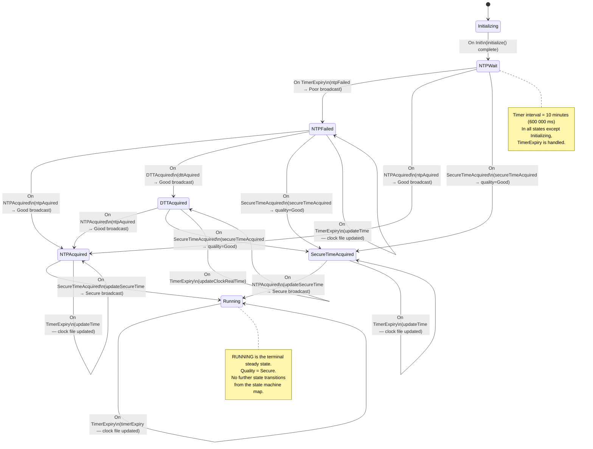
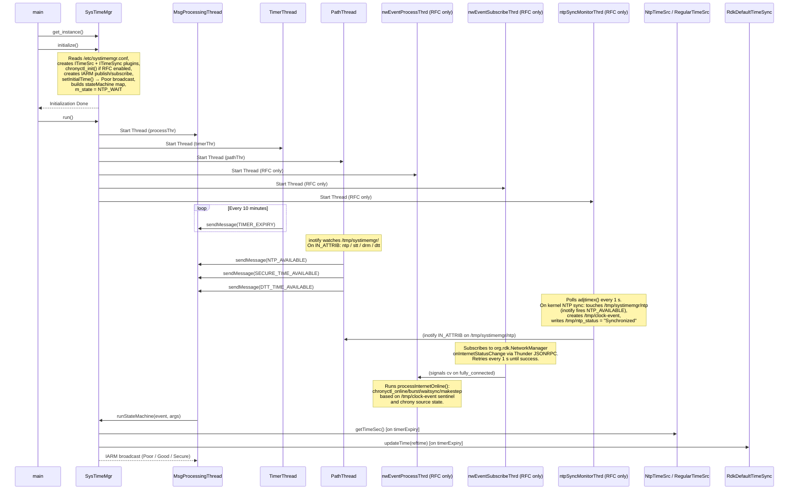

## Purpose

Defines the time quality state machine transitions — from Poor (initial/NTP fail) to Good (NTP or DTT acquired) to Secure (DRM acquired) — and the IARM broadcast emitted at each transition.

---

## State Machine Diagram

> **Wiki vs. code discrepancy**: The official Confluence state diagram shows a `Running → SecureTimeAcquired` transition on `SecureTimeAcquired` event. That transition does **not** exist in the code's `stateMachine` map and is a documentation artifact. The diagram above reflects the actual code.

---

## Sequence Diagram

The sequence diagram below shows the full thread model. Threads in parentheses are only started when `m_chronyRfcEnabled` is `true`.

---

## Requirements
### Requirement: Initial Time Quality is Poor

When SystemTimeManager starts, time quality MUST be `Poor` until a reliable time source is acquired.

#### Scenario: Quality is Poor at startup

- **WHEN** SystemTimeManager completes `setInitialTime()`
- **THEN** `m_timequality` is set to `eTIMEQUALILTY_POOR`
- **AND** an IARM broadcast with message `"Poor"` is emitted

---

### Requirement: NTP Timeout Transitions Quality to Poor (NTP_FAIL)

If NTP is not acquired within the timer interval, the state machine MUST record NTP failure and broadcast `Poor` quality.

#### Scenario: NTP timer expires without sync

- **WHEN** the state is `eSYSMGR_STATE_NTP_WAIT`
- **AND** a `eSYSMGR_EVENT_TIMER_EXPIRY` event fires before NTP is acquired
- **THEN** `ntpFailed()` is called
- **AND** state transitions to `eSYSMGR_STATE_NTP_FAIL`
- **AND** `publishStatus(ePUBLISH_NTP_FAIL, "Poor")` is called
- **AND** an IARM broadcast with message `"Poor"` is emitted

---

### Requirement: NTP Acquisition Transitions Quality to Good

When the NTP time source signals availability, time quality MUST be upgraded to `Good`.

#### Scenario: NTP becomes available in NTP_WAIT state

- **WHEN** the state is `eSYSMGR_STATE_NTP_WAIT`
- **AND** a `eSYSMGR_EVENT_NTP_AVAILABLE` event is received
- **THEN** `ntpAquired()` is called
- **AND** `m_timequality` is set to `eTIMEQUALILTY_GOOD`
- **AND** state transitions to `eSYSMGR_STATE_NTP_ACQUIRED`
- **AND** `m_timersrc` is set to `"NTP"`
- **AND** `publishStatus(ePUBLISH_NTP_SUCCESS, "Good")` is called
- **AND** an IARM broadcast with message `"Good"` is emitted

#### Scenario: NTP becomes available after NTP_FAIL

- **WHEN** the state is `eSYSMGR_STATE_NTP_FAIL`
- **AND** a `eSYSMGR_EVENT_NTP_AVAILABLE` event is received
- **THEN** `ntpAquired()` is called
- **AND** state transitions to `eSYSMGR_STATE_NTP_ACQUIRED` with quality `eTIMEQUALILTY_GOOD`
- **AND** an IARM broadcast with message `"Good"` is emitted

---

### Requirement: DTT Acquisition Transitions Quality to Good

When DTT time becomes available (NTP having already failed), time quality MUST be upgraded to `Good` via the DTT path.

#### Scenario: DTT acquired after NTP failure

- **WHEN** the state is `eSYSMGR_STATE_NTP_FAIL`
- **AND** a `eSYSMGR_EVENT_DTT_TIME_AVAILABLE` event is received
- **THEN** `dttAquired()` is called
- **AND** `m_timequality` is set to `eTIMEQUALILTY_GOOD`
- **AND** state transitions to `eSYSMGR_STATE_DTT_ACQUIRED`
- **AND** `m_timersrc` is set to `"DTT"`
- **AND** `publishStatus(ePUBLISH_DTT_SUCCESS, "Good")` is called
- **AND** an IARM broadcast with message `"Good"` is emitted

---

### Requirement: DRM Secure Time Transitions Quality from Good to Secure

When DRM (secure time) becomes available after NTP or DTT has already been acquired, time quality MUST be upgraded to `Secure`.

#### Scenario: Secure time acquired after NTP

- **WHEN** the state is `eSYSMGR_STATE_NTP_ACQUIRED`
- **AND** a `eSYSMGR_EVENT_SECURE_TIME_AVAILABLE` event is received
- **THEN** `updateSecureTime()` is called
- **AND** `m_timequality` is set to `eTIMEQUALILTY_SECURE`
- **AND** state transitions to `eSYSMGR_STATE_RUNNING`
- **AND** `publishStatus(ePUBLISH_SECURE_TIME_SUCCESS, "Secure")` is called
- **AND** an IARM broadcast with message `"Secure"` is emitted

---

### Requirement: Time Quality Query Response

When any component queries the current time quality via `TIMER_STATUS_MSG`, SystemTimeManager MUST return the current quality enum value with a matching string label.

#### Scenario: Quality reported as Poor

- **WHEN** `getTimeStatus()` is called
- **AND** `m_timequality` is `eTIMEQUALILTY_POOR`
- **THEN** the `TimerMsg` is populated with quality `eTIMEQUALILTY_POOR` and message `"Poor"`

#### Scenario: Quality reported as Good

- **WHEN** `getTimeStatus()` is called
- **AND** `m_timequality` is `eTIMEQUALILTY_GOOD`
- **THEN** the `TimerMsg` is populated with quality `eTIMEQUALILTY_GOOD` and message `"Good"`

#### Scenario: Quality reported as Secure

- **WHEN** `getTimeStatus()` is called
- **AND** `m_timequality` is `eTIMEQUALILTY_SECURE`
- **THEN** the `TimerMsg` is populated with quality `eTIMEQUALILTY_SECURE` and message `"Secure"`

